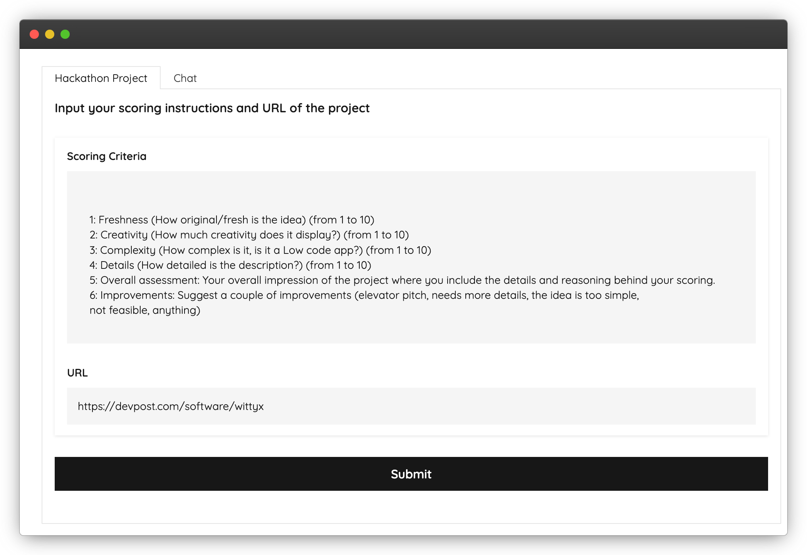
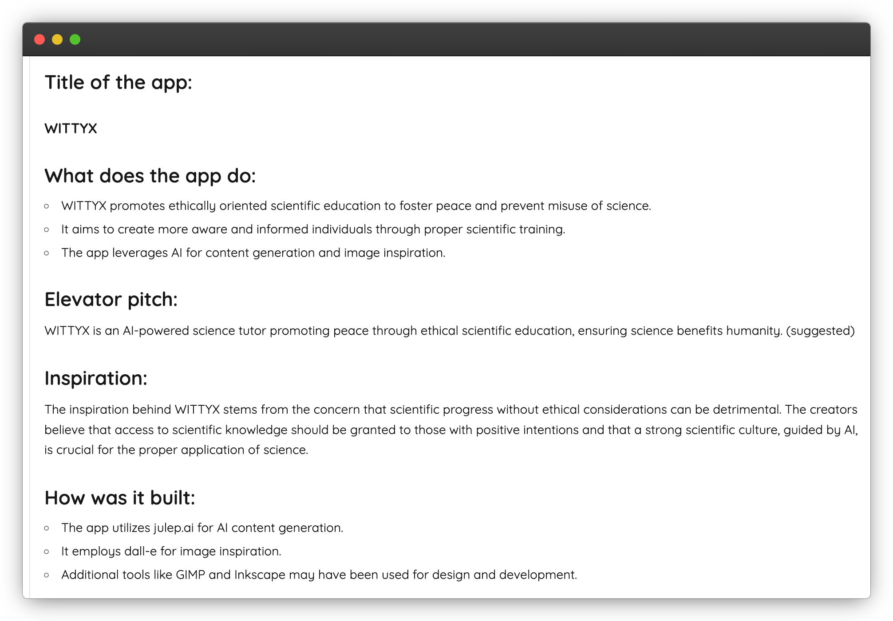
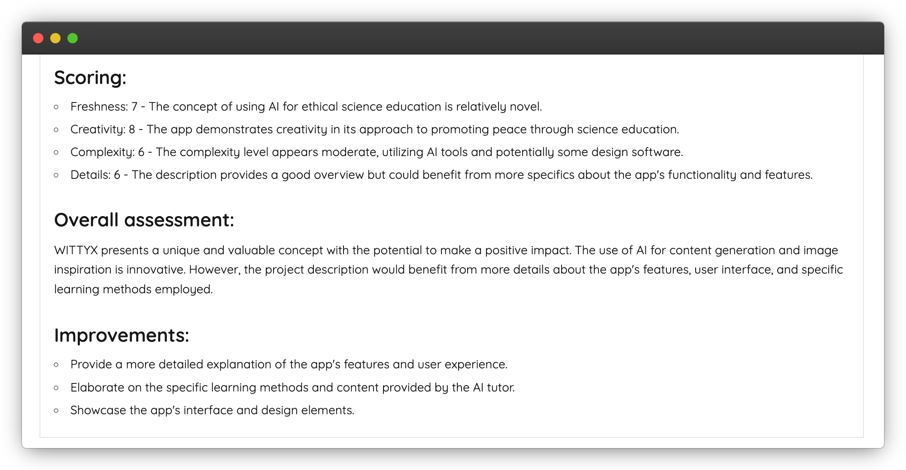

# Gemini's Mirror

The hackathon project that evaluates hackathon projects, providing instant, detailed feedback to judges and participants alike – while offering a nice meta twist 😉

## Inspiration

What about a fresh idea for a Hackathon project submission? Instead of the usual AI-powered interactive storytelling apps or emotional support chatbots, why not flip the script? How about a project that allows participants and judges to quickly analyze submissions, offering feedback and suggestions on the idea's uniqueness, how to refine the elevator pitch, and how well it aligns with the hackathon's theme?

## What it does

"Gemini's Mirror" is a web-based tool  that helps participants and judges efficiently evaluate submissions based on customizable criteria, refining elevator pitches and aligning ideas with hackathon themes. You provide the URL to the project page, and Gemini's Mirror generates instant, detailed feedback, and you can even engage in a chat session so you can discuss the feedback further and take your project to the next level!

## How to run it

### Python 3.7 environment

`pip install -r requirements.txt`

### Set Environment Variable: Google API Key

`export GENAI_API_KEY="AIGhJh7rnA49x3bkBNfXAdj8D-rSX4ev"`

### Run the Project

`python gmirr.py`

### Open in browser

`http://127.0.0.1:7860`